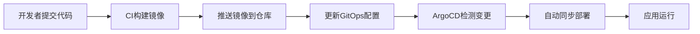

# 📚 GitOps 配置详细学习文档

这是基于 ArgoCD 的 GitOps 配置仓库，实现了微服务的声明式部署和环境管理。

## 📁 项目结构全解析

```
project-gitops-config/
├── README.md                      # 项目说明文档
├── argocd/                        # ArgoCD 配置目录
│   ├── app-of-apps.yaml          # App-of-Apps 模式主配置
│   └── applications/              # 各应用的 ArgoCD Application 定义
│       ├── README.md              # 应用配置说明
│       ├── microservice1-dev.yaml    # 微服务1 DEV环境应用定义
│       ├── microservice1-sit.yaml    # 微服务1 SIT环境应用定义
│       ├── microservice2-dev.yaml    # 微服务2 DEV环境应用定义
│       ├── microservice2-sit.yaml    # 微服务2 SIT环境应用定义
│       ├── kube-prometheus-stack-monitoring.yaml          # DEV监控应用定义
│       └── kube-prometheus-stack-monitoring-sit.yaml.disabled  # SIT监控应用(已禁用)
├── charts/                        # Helm Chart 模板目录
│   ├── microservice1/            # 微服务1 Helm Chart
│   ├── microservice2/            # 微服务2 Helm Chart  
│   └── kube-prometheus-stack/    # 监控栈 Helm Chart
└── environments/                  # 环境特定配置
    ├── dev/                      # DEV环境配置
    ├── sit/                      # SIT环境配置
    └── staging/                  # STAGING环境配置
```

---

## 🚀 ArgoCD App-of-Apps 模式详解

### app-of-apps.yaml 逐行解析

**📝 这是 ArgoCD 的 App-of-Apps 模式实现，用于管理多个应用的部署**

```yaml
apiVersion: argoproj.io/v1alpha1
# 🌟 API版本: ArgoCD Application的API版本标识
# 固定写法: ArgoCD v1alpha1 API规范

kind: Application  
# 🌟 资源类型: ArgoCD Application资源
# 固定写法: ArgoCD的核心资源类型

metadata:
  name: project-app-of-apps
  # 🔧 应用名称: 管理所有子应用的根应用名称
  # 💡 命名约定: 通常使用项目名-app-of-apps格式
  
  namespace: argocd
  # 🌟 命名空间: ArgoCD Application必须部署在argocd命名空间
  # 固定写法: ArgoCD的标准部署命名空间

spec:
  project: default
  # 🔧 ArgoCD项目: 指定应用所属的ArgoCD项目
  # 💡 权限管理: 可通过项目控制应用的权限和策略
  
  source:
    repoURL: https://github.com/1979447992/project-gitops-config.git
    # 🌟 Git仓库: GitOps配置的源仓库地址
    # 🔧 可配置: 根据实际Git仓库地址修改
    
    targetRevision: main
    # 🌟 目标分支: 使用main分支作为配置源
    # 💡 分支策略: 生产环境建议使用标签或稳定分支
    
    path: argocd/applications
    # 🌟 配置路径: 指向applications目录，包含所有子应用定义
    # 💡 目录约定: 此目录下的所有.yaml文件都会被识别为子应用
    
  destination:
    server: https://kubernetes.default.svc
    # 🌟 目标集群: 部署到当前ArgoCD所在的Kubernetes集群
    # 固定写法: 本地集群的标准地址
    
    namespace: argocd
    # 🌟 目标命名空间: App-of-Apps本身部署在argocd命名空间
    
  syncPolicy:
    automated:
      prune: true
      # 🌟 自动清理: 删除不再需要的资源
      # 💡 安全特性: 确保集群状态与Git配置保持一致
      
      selfHeal: true
      # 🌟 自我修复: 自动修复被手动修改的资源
      # 💡 GitOps原则: 确保Git是唯一的真实来源
      
    syncOptions:
      - CreateNamespace=true
      # 🌟 命名空间创建: 自动创建不存在的命名空间
      # 💡 便利特性: 简化多环境部署的配置
```

---

## 📋 ArgoCD Application 配置详解

### microservice1-dev.yaml 逐行解析

**📝 微服务1 DEV环境的ArgoCD应用定义，展示了标准的GitOps部署模式**

```yaml
apiVersion: argoproj.io/v1alpha1
# 固定写法: ArgoCD Application的API版本

kind: Application
# 固定写法: ArgoCD Application资源类型

metadata:
  name: microservice1-dev
  # 🌟 应用标识: 应用名称包含服务名和环境信息
  # 💡 命名约定: {服务名}-{环境} 格式便于管理
  
  namespace: argocd
  # 固定写法: 所有ArgoCD Application都在argocd命名空间

spec:
  project: default
  # 🔧 项目归属: 使用默认项目，生产环境可创建专门项目
  
  source:
    repoURL: https://github.com/1979447992/project-gitops-config.git
    # 🌟 配置源: GitOps配置仓库地址
    # ⚠️ 依赖: 需要确保ArgoCD有访问此仓库的权限
    
    targetRevision: main
    # 🌟 版本控制: 使用main分支的最新配置
    # 💡 生产建议: 使用特定标签或release分支
    
    path: charts/microservice1
    # 🌟 Chart路径: 指向microservice1的Helm Chart目录
    # 💡 模板复用: 同一个Chart可用于不同环境
    
    helm:
      valueFiles:
        - ../../environments/dev/microservice1-values.yaml
        # 🌟 环境配置: 指定DEV环境的值文件
        # 💡 路径解释: 相对于charts/microservice1的路径
        # 🔧 配置分离: 模板与环境配置分离，便于管理
        
  destination:
    server: https://kubernetes.default.svc
    # 固定写法: 目标Kubernetes集群地址
    
    namespace: microservice1-dev
    # 🌟 目标命名空间: 微服务1的DEV环境命名空间
    # 💡 隔离策略: 每个服务每个环境使用独立命名空间
    
  syncPolicy:
    automated:
      prune: true
      # 🌟 资源清理: 自动删除不再定义的资源
      # 💡 一致性保证: 确保集群状态与Git完全一致
      
      selfHeal: true
      # 🌟 自动修复: 检测并修复配置漂移
      # 💡 运维自动化: 减少手动干预需求
      
    syncOptions:
      - CreateNamespace=true
      # 🌟 命名空间管理: 自动创建microservice1-dev命名空间
      # 💡 部署简化: 无需预先手动创建命名空间
```

---

## 📦 Helm Chart 模板详解

### microservice1/Chart.yaml 解析

**📝 Helm Chart 的元数据定义文件**

```yaml
apiVersion: v2
# 🌟 Helm API版本: 使用Helm 3.x的v2 API
# 固定写法: Helm 3的标准API版本

name: microservice1
# 🌟 Chart名称: 必须与目录名保持一致
# 💡 命名约定: 使用小写字母和连字符

description: A Helm chart for Microservice 1
# 🔧 Chart描述: 简要说明此Chart的用途

type: application
# 🌟 Chart类型: application表示这是应用程序Chart
# 💡 类型选择: 与library类型区分，application用于部署

version: 0.1.0
# 🌟 Chart版本: 语义化版本号，每次Chart变更时递增
# 💡 版本管理: 与应用版本独立管理

appVersion: "1.16.0"
# 🔧 应用版本: 此Chart部署的应用版本
# 💡 版本追踪: 用于记录Chart对应的应用版本
```

### microservice1/templates/deployment.yaml 详解

**📝 Kubernetes Deployment 模板，定义了微服务的部署配置**

```yaml
apiVersion: apps/v1
# 固定写法: Kubernetes Deployment的API版本

kind: Deployment
# 固定写法: Kubernetes Deployment资源类型

metadata:
  name: {{ .Chart.Name }}
  # 🌟 Helm模板: 使用Chart名称作为Deployment名称
  # 💡 动态命名: 确保资源名称与Chart名称一致
  
  labels:
    app: {{ .Chart.Name }}
    # 🌟 标签标识: 使用app标签标识应用
    # 💡 资源关联: Service、ServiceMonitor通过此标签选择Pod

spec:
  replicas: {{ .Values.replicaCount }}
  # 🌟 副本数量: 从values.yaml读取副本配置
  # 💡 可配置性: 不同环境可设置不同的副本数

  selector:
    matchLabels:
      app: {{ .Chart.Name }}
      # 🌟 选择器: Deployment管理具有此标签的Pod
      # 固定写法: 必须与template.metadata.labels匹配

  template:
    metadata:
      labels:
        app: {{ .Chart.Name }}
        # 🌟 Pod标签: 为Pod添加应用标识标签
        # 💡 一致性: 与selector.matchLabels保持一致

    spec:
      imagePullSecrets:
        - name: ghcr-secret
        # 🌟 镜像拉取密钥: 用于从私有镜像仓库拉取镜像
        # 🔧 配置要求: 需要预先创建ghcr-secret Secret

      containers:
        - name: {{ .Chart.Name }}
          # 🌟 容器名称: 使用Chart名称作为容器名

          image: "{{ .Values.image.repository }}:{{ .Values.image.tag }}"
          # 🌟 镜像配置: 动态拼接镜像地址和标签
          # 💡 环境隔离: 不同环境可使用不同镜像标签

          imagePullPolicy: {{ .Values.image.pullPolicy }}
          # 🌟 拉取策略: 控制何时拉取镜像
          # 💡 策略选择: Always(总是), IfNotPresent(如不存在), Never(从不)

          ports:
            - containerPort: {{ .Values.service.port }}
              # 🌟 容器端口: 容器内应用监听的端口
              # 💡 配置一致: 必须与应用的server.port保持一致

          resources:
            {{- toYaml .Values.resources | nindent 12 }}
            # 🌟 资源限制: CPU和内存的requests/limits配置
            # 💡 Helm函数: toYaml转换YAML，nindent控制缩进

          {{- if .Values.env }}
          env:
            {{- range .Values.env }}
            - name: {{ .name }}
              value: {{ .value | quote }}
            {{- end }}
          {{- end }}
          # 🌟 环境变量: 动态配置环境变量
          # 💡 条件渲染: 只有在定义了env时才渲染此部分
          # 🔧 安全处理: quote函数确保值被正确引用
```

### microservice1/templates/service.yaml 详解

**📝 Kubernetes Service 模板，定义了微服务的网络访问**

```yaml
apiVersion: v1
# 固定写法: Kubernetes Service的API版本

kind: Service
# 固定写法: Kubernetes Service资源类型

metadata:
  name: {{ .Chart.Name }}
  # 🌟 服务名称: 使用Chart名称，确保服务发现的一致性

  labels:
    app: {{ .Chart.Name }}
    # 🌟 服务标签: 便于管理和选择

spec:
  type: {{ .Values.service.type }}
  # 🌟 服务类型: ClusterIP/NodePort/LoadBalancer
  # 💡 环境配置: 不同环境可使用不同的服务类型

  ports:
    - port: {{ .Values.service.port }}
      # 🌟 服务端口: Service对外暴露的端口

      targetPort: {{ .Values.service.port }}
      # 🌟 目标端口: 转发到Pod的端口
      # 💡 端口映射: 通常与service.port相同

      protocol: TCP
      # 固定写法: HTTP服务使用TCP协议

      name: http
      # 🌟 端口名称: 为端口命名，便于ServiceMonitor引用

  selector:
    app: {{ .Chart.Name }}
    # 🌟 Pod选择器: 选择具有此标签的Pod作为后端
    # 💡 服务发现: 与Deployment的Pod标签匹配
```

### microservice1/templates/servicemonitor.yaml 详解

**📝 Prometheus ServiceMonitor 模板，定义了监控数据收集配置**

```yaml
apiVersion: monitoring.coreos.com/v1
# 🌟 API版本: Prometheus Operator的ServiceMonitor API
# 固定写法: 由Prometheus Operator提供的CRD

kind: ServiceMonitor
# 🌟 资源类型: ServiceMonitor是Prometheus Operator的自定义资源

metadata:
  name: microservice1-monitor
  # 🌟 监控器名称: 明确标识此监控配置

  namespace: {{ .Values.namespace | default "microservice1-dev" }}
  # 🌟 命名空间: ServiceMonitor必须与目标Service在同一命名空间
  # 💡 默认值: 如果未配置则使用微服务1的DEV命名空间

  labels:
    app: microservice1
    # 🌟 应用标签: 标识监控的应用

    release: kube-prometheus-stack
    # 🌟 Release标签: Prometheus Operator通过此标签发现ServiceMonitor
    # ⚠️ 关键配置: 必须与kube-prometheus-stack的配置匹配

    environment: {{ .Values.environment | default "dev" }}
    # 🔧 环境标签: 区分不同环境的监控配置

spec:
  selector:
    matchLabels:
      app: microservice1
      # 🌟 服务选择器: 选择要监控的Service
      # 💡 标签匹配: 与Service的标签保持一致

  endpoints:
  - port: http
    # 🌟 监控端口: 使用Service中定义的http端口

    path: /actuator/prometheus
    # 🌟 指标路径: Spring Boot Actuator暴露Prometheus指标的路径
    # 固定写法: Spring Boot Actuator的标准指标端点

    interval: 30s
    # 🌟 抓取间隔: 每30秒收集一次指标
    # 💡 频率权衡: 平衡监控精度和系统负载

    scrapeTimeout: 10s
    # 🌟 抓取超时: 10秒内必须完成指标收集
    # 💡 超时设置: 应小于interval值

  namespaceSelector:
    matchNames:
    - {{ .Values.namespace | default "microservice1-dev" }}
    # 🌟 命名空间选择: 限制监控范围到特定命名空间
    # 💡 安全隔离: 防止跨命名空间的意外监控
```

---

## ⚙️ Helm Values 配置详解

### charts/microservice1/values.yaml (默认值)

**📝 Helm Chart 的默认配置，定义了所有可配置参数的默认值**

```yaml
replicaCount: 1
# 🌟 副本数量: 默认部署1个Pod副本
# 💡 扩展性: 生产环境通常设置为2+以确保高可用

image:
  repository: ghcr.io/1979447992/microservice1
  # 🌟 镜像仓库: 默认的镜像仓库地址
  # 🔧 可覆盖: 环境特定values文件可覆盖此值

  pullPolicy: Always
  # 🌟 拉取策略: 总是拉取最新镜像
  # 💡 开发友好: 确保始终使用最新构建的镜像

  tag: "latest"
  # 🌟 镜像标签: 默认使用latest标签
  # ⚠️ 生产不建议: 生产环境应使用具体版本标签

service:
  type: ClusterIP
  # 🌟 服务类型: 默认使用集群内部访问
  # 💡 类型选择: ClusterIP(内部)/NodePort(外部)/LoadBalancer(云)

  port: 8080
  # 🌟 服务端口: 与Spring Boot应用端口保持一致
  # 固定写法: Spring Boot默认端口

resources:
  limits:
    cpu: 200m
    memory: 128Mi
    # 🌟 资源上限: CPU和内存的最大使用量
    # 💡 防护机制: 防止单个Pod耗尽节点资源

  requests:
    cpu: 100m
    memory: 64Mi
    # 🌟 资源请求: 保证的最小资源分配
    # 💡 调度保证: Kubernetes调度器据此分配Pod

ingress:
  enabled: false
  # 🌟 Ingress配置: 默认禁用外部访问
  # 💡 安全考虑: 仅在需要时启用外部访问

env: []
# 🌟 环境变量: 默认为空数组
# 💡 扩展点: 环境特定配置可添加环境变量
```

### environments/dev/microservice1-values.yaml (环境特定配置)

**📝 DEV环境的特定配置，覆盖默认值以适应开发环境需求**

```yaml
image:
  repository: ghcr.io/1979447992/microservice1/microservice1
  # 🌟 环境镜像: DEV环境使用特定的镜像仓库路径
  # 💡 路径差异: 与默认值不同，包含额外的路径层级

  tag: "dev-94ddda1"
  # 🌟 版本标签: 使用Git提交哈希作为镜像标签
  # 💡 版本追踪: 确保部署的是特定代码版本构建的镜像

  pullPolicy: Always
  # 🌟 拉取策略: DEV环境总是拉取最新镜像
  # 💡 开发便利: 确保代码变更立即生效

replicaCount: 1
# 🌟 开发副本: DEV环境通常只需要1个副本
# 💡 资源节约: 开发环境优先考虑资源效率

resources:
  limits:
    cpu: 200m
    memory: 128Mi
    # 🌟 开发资源限制: 适中的资源配置

  requests:
    cpu: 100m
    memory: 64Mi
    # 🌟 开发资源请求: 保守的资源请求

service:
  type: ClusterIP
  # 🌟 内部服务: DEV环境使用集群内访问
  # 💡 调试方式: 通过kubectl port-forward进行调试

  port: 8080
  # 固定写法: 与应用端口保持一致

env:
  - name: APP_ENVIRONMENT
    value: "DEV"
    # 🌟 环境标识: 设置应用环境变量
    # 💡 应用感知: 应用代码可通过此变量识别运行环境
```

---

## 🎯 GitOps 工作流程详解

### 1. 代码变更到部署的完整流程



### 2. 环境配置管理策略

**📝 环境配置通过 environments/ 目录分层管理**

```yaml
# 基础配置层 (charts/microservice1/values.yaml)
replicaCount: 1      # 默认副本数
resources: {...}     # 默认资源配置

# 环境配置层 (environments/dev/microservice1-values.yaml)  
image:
  tag: "dev-abc123"  # 环境特定镜像
env:
  - name: APP_ENVIRONMENT
    value: "DEV"     # 环境标识
```

### 3. 多环境部署模式

| 环境 | 命名空间 | 镜像标签 | 副本数 | 资源配置 | 监控 |
|------|----------|----------|--------|----------|------|
| **DEV** | microservice1-dev | dev-{hash} | 1 | 低配置 | 基础监控 |
| **SIT** | microservice1-sit | sit-{hash} | 1 | 中配置 | 完整监控 |
| **STAGING** | microservice1-staging | staging-{hash} | 2 | 高配置 | 生产级监控 |

---

## 📊 监控配置深度解析

### kube-prometheus-stack 配置模式

**📝 监控栈的分层配置设计**

#### 1. 基础监控配置 (charts/kube-prometheus-stack/values.yaml)
```yaml
# 基础Prometheus配置
prometheus:
  prometheusSpec:
    retention: 15d          # 默认保留时间
    storageSpec:
      volumeClaimTemplate:
        spec:
          storageClassName: "local-path"
          accessModes: ["ReadWriteOnce"]
          resources:
            requests:
              storage: 10Gi  # 默认存储大小
```

#### 2. 环境特定配置 (environments/dev/kube-prometheus-stack-values.yaml)
```yaml
kube-prometheus-stack:
  prometheus:
    service:
      type: NodePort
      nodePort: 30090       # DEV环境外部访问端口
    prometheusSpec:
      retention: 3d         # DEV环境较短保留时间
      resources:
        limits:
          memory: 1Gi       # DEV环境资源配置
```

### ServiceMonitor 自动发现机制

**📝 Prometheus通过ServiceMonitor自动发现监控目标**

```yaml
# ServiceMonitor 关键配置
metadata:
  labels:
    release: kube-prometheus-stack  # 关键标签
spec:
  selector:
    matchLabels:
      app: microservice1            # 选择目标Service
  endpoints:
  - port: http
    path: /actuator/prometheus      # Spring Boot指标端点
```

**🔗 监控链路:**
1. **ServiceMonitor** 定义监控目标
2. **Prometheus** 根据标签发现ServiceMonitor
3. **Service** 提供稳定的访问端点
4. **Pod** 暴露 `/actuator/prometheus` 指标
5. **Grafana** 查询Prometheus数据进行可视化

---

## 🔐 安全和权限管理

### 1. 镜像拉取认证
```yaml
# Deployment中的镜像拉取密钥配置
imagePullSecrets:
  - name: ghcr-secret
```

**配置步骤:**
```bash
# 创建Docker镜像仓库认证Secret
kubectl create secret docker-registry ghcr-secret \
  --docker-server=ghcr.io \
  --docker-username=<username> \
  --docker-password=<token> \
  --namespace=microservice1-dev
```

### 2. ArgoCD RBAC
```yaml
# ArgoCD Application的项目配置
spec:
  project: default  # 可创建专门项目限制权限
```

### 3. 命名空间隔离
```yaml
# 每个服务每个环境独立命名空间
destination:
  namespace: microservice1-dev  # 环境隔离
```

---

## 🎯 最佳实践总结

### 🌟 GitOps 固定模式

#### 1. 目录结构模式
```
├── argocd/                    # ArgoCD配置
│   ├── app-of-apps.yaml      # 根应用
│   └── applications/         # 子应用定义
├── charts/                   # Helm模板
│   └── {service}/            # 服务特定Chart
└── environments/             # 环境配置
    └── {env}/                # 环境特定values
```

#### 2. 命名约定模式
```yaml
# ArgoCD Application命名
name: {service}-{environment}  # microservice1-dev

# Kubernetes资源命名  
namespace: {service}-{environment}  # microservice1-dev

# Helm Chart命名
name: {service}  # microservice1
```

#### 3. 标签管理模式
```yaml
# 标准标签集
labels:
  app: {service}                    # 服务标识
  environment: {env}                # 环境标识
  release: kube-prometheus-stack    # 监控发现
```

### 🔧 环境配置策略

#### 1. 配置分层
- **Base Values**: Chart默认配置
- **Environment Values**: 环境特定覆盖
- **Runtime Config**: 环境变量和ConfigMap

#### 2. 镜像管理
```yaml
# 开发环境
image:
  tag: "dev-{git-hash}"     # 开发分支构建

# 生产环境  
image:
  tag: "v1.2.3"            # 语义化版本标签
```

#### 3. 资源配置
```yaml
# 开发环境 - 资源节约
resources:
  requests: { cpu: 100m, memory: 64Mi }
  limits: { cpu: 200m, memory: 128Mi }

# 生产环境 - 性能保证
resources:
  requests: { cpu: 500m, memory: 512Mi }
  limits: { cpu: 1000m, memory: 1Gi }
```

### ⚠️ 运维注意事项

#### 1. 版本管理
- 使用具体版本标签，避免latest
- Git提交哈希用于开发环境
- 语义化版本用于生产环境

#### 2. 监控配置
- ServiceMonitor标签必须正确
- 监控端点路径与应用配置一致
- 抓取间隔平衡精度和性能

#### 3. 安全考虑
- 镜像拉取密钥正确配置
- 资源限制防止资源耗尽
- 命名空间隔离环境资源

---

## 🚀 部署验证流程

### 1. ArgoCD应用状态检查
```bash
# 检查App-of-Apps状态
argocd app get project-app-of-apps

# 检查子应用状态
argocd app list
argocd app get microservice1-dev
```

### 2. Kubernetes资源验证
```bash
# 检查Pod状态
kubectl get pods -n microservice1-dev

# 检查Service配置
kubectl get svc -n microservice1-dev

# 检查ServiceMonitor
kubectl get servicemonitor -n microservice1-dev
```

### 3. 应用功能测试
```bash
# 健康检查
kubectl port-forward -n microservice1-dev svc/microservice1 8080:8080
curl http://localhost:8080/health

# 监控指标检查
curl http://localhost:8080/actuator/prometheus
```

### 4. 监控数据验证
```bash
# Prometheus目标检查
kubectl port-forward -n monitoring svc/kube-prometheus-stack-prometheus 9090:9090
# 访问 http://localhost:9090/targets

# Grafana面板检查  
kubectl port-forward -n monitoring svc/kube-prometheus-stack-grafana 3000:80
# 访问 http://localhost:3000
```

---

## 🎯 学习要点总结

### 🌟 GitOps核心概念
1. **声明式配置**: 所有部署配置都在Git中声明
2. **自动同步**: ArgoCD自动检测变更并部署
3. **配置分离**: 模板与环境配置分离管理
4. **版本控制**: 所有变更都有Git历史记录

### 🔧 Helm模板化
1. **模板复用**: 一套Chart模板支持多环境
2. **参数化配置**: 通过Values实现配置灵活性
3. **条件渲染**: 根据配置动态生成资源
4. **命名空间管理**: 自动创建和管理命名空间

### 📊 监控集成
1. **自动发现**: ServiceMonitor自动发现监控目标
2. **指标标准化**: 统一的Prometheus指标格式
3. **多环境监控**: 支持不同环境的监控配置
4. **可视化展示**: Grafana提供统一的监控面板

### ⚠️ 生产考虑
1. **安全性**: 镜像仓库认证、RBAC权限控制
2. **可靠性**: 资源限制、健康检查、副本配置
3. **可观测性**: 全面的监控和日志收集
4. **可维护性**: 清晰的目录结构和命名约定